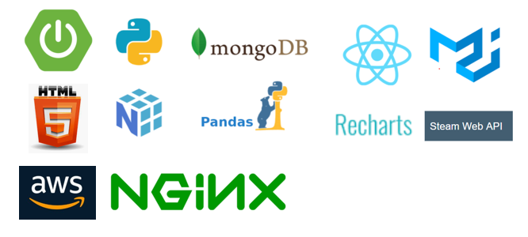

___
> 정리되어있지 않는 스팀 게임들을 개개인에게 맞는 게임을 추천해주는 시스템

## 프로젝트 소개

### 실행방법
* backend 폴더를 sts 혹은 vscode와 같은 편집기로 import하여 실행시킵니다.
* frontend 폴더를 vscode와 같은 편집기로 실행시킵니다.
* frontend 폴더 위치에서 cmd를 실행시킵니다.
* cmd에서 npm install 명령어를 실행시킵니다.
* install이 완료된 후 yarn start 명령어를 실행시킵니다.
* 웹 브라우저에서 localhost:port를 실행합니다.
* 현재 진행된 내용으로는 localhost:port/search로 직접 접근하시면 게임의 상세페이지까지 접근하실 수 있습니다.
* 첫 실행은 다소 오래걸릴 수 있습니다.

### 프로젝트 명 < 스겜추 > 

###  개요
> 정리되어있지 않는 스팀 게임들을 개개인에게 맞는 게임을 추천해주는 시스템

### 기능
> steam 로그인 api 서비스
> steam game 정보 공유 및 검색 기능
> 사용자가 좋아하는 게임 정보를 유추하기 위한 설문
> 설문 정보를 기반으로 사용자에게 맞는 게임 추천

### 기술 스택

## 기술 설명
___
### ERD

### 디렉토리 구조도
>
    
